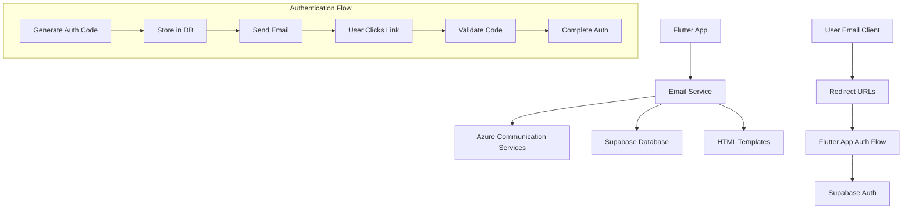

# Design Document

## Overview

This design implements a secure Azure Communication Services-based email service to replace Supabase's email service limitations. The system will handle email confirmation and password reset functionality using existing HTML templates, with secure time-limited authentication codes that integrate seamlessly with Supabase Auth.

The solution consists of a Flutter-based email service that communicates with Azure Communication Services, a database migration to store authentication codes, and integration points with the existing Supabase Auth flow.

## Architecture

### High-Level Architecture



### Component Interaction Flow

1. **Email Trigger**: User initiates signup or password reset
2. **Code Generation**: System generates secure authentication code
3. **Database Storage**: Code stored with expiration timestamp
4. **Email Composition**: Template populated with code and redirect URL
5. **Email Sending**: Azure Communication Services sends email
6. **User Action**: User clicks email link with authentication code
7. **Code Validation**: System validates code and expiration
8. **Auth Completion**: Supabase Auth completes the process

## Components and Interfaces

### 1. Email Service (`lib/src/core/services/azure_email_service.dart`)

**Purpose**: Core service for sending emails via Azure Communication Services

**Key Methods**:

- `sendConfirmationEmail(String email, String userId)`: Sends signup confirmation
- `sendPasswordResetEmail(String email, String userId)`: Sends password reset
- `_generateAuthCode()`: Creates secure authentication codes
- `_buildEmailContent(String template, Map<String, String> variables)`: Processes templates

**Dependencies**:

- Azure Communication Services HTTP API
- Environment configuration
- HTML template files

### 2. Authentication Code Repository (`lib/src/features/auth/data/repositories/auth_code_repository.dart`)

**Purpose**: Manages authentication code storage and validation

**Key Methods**:

- `storeAuthCode(String code, String userId, AuthCodeType type)`: Stores code with expiration
- `validateAuthCode(String code, AuthCodeType type)`: Validates code and checks expiration
- `invalidateAuthCode(String code)`: Marks code as used
- `cleanupExpiredCodes()`: Removes expired codes

### 3. Email Template Manager (`lib/src/core/services/email_template_manager.dart`)

**Purpose**: Handles HTML template processing and variable substitution

**Key Methods**:

- `loadTemplate(String templateName)`: Loads HTML template from assets
- `processTemplate(String template, Map<String, String> variables)`: Substitutes variables
- `generateRedirectUrl(String code, AuthCodeType type)`: Creates redirect URLs

### 4. Azure Configuration (`lib/src/core/config/azure_config.dart`)

**Purpose**: Manages Azure Communication Services configuration

**Properties**:

- `emailServiceEndpoint`: Azure Communication Services endpoint
- `azureKey`: Authentication key
- `connectionString`: Azure connection string

## Data Models

### Authentication Code Model

```dart
class AuthCode {
  final String id;
  final String code;
  final String userId;
  final AuthCodeType type;
  final DateTime createdAt;
  final DateTime expiresAt;
  final bool isUsed;
  final String? usedAt;
}

enum AuthCodeType {
  emailConfirmation,
  passwordReset
}
```

### Email Request Model

```dart
class EmailRequest {
  final String to;
  final String subject;
  final String htmlContent;
  final String from;
}
```

### Database Schema

**Table: `auth_codes`**

```sql
CREATE TABLE auth_codes (
  id UUID PRIMARY KEY DEFAULT gen_random_uuid(),
  code VARCHAR(32) NOT NULL UNIQUE,
  user_id UUID NOT NULL,
  type VARCHAR(20) NOT NULL CHECK (type IN ('email_confirmation', 'password_reset')),
  created_at TIMESTAMP WITH TIME ZONE DEFAULT NOW(),
  expires_at TIMESTAMP WITH TIME ZONE NOT NULL,
  is_used BOOLEAN DEFAULT FALSE,
  used_at TIMESTAMP WITH TIME ZONE,
  CONSTRAINT fk_auth_codes_user_id FOREIGN KEY (user_id) REFERENCES auth.users(id) ON DELETE CASCADE
);

CREATE INDEX idx_auth_codes_code ON auth_codes(code);
CREATE INDEX idx_auth_codes_user_type ON auth_codes(user_id, type);
CREATE INDEX idx_auth_codes_expires_at ON auth_codes(expires_at);
```

## Error Handling

### Error Categories

1. **Azure Communication Services Errors**

   - Network connectivity issues
   - Authentication failures
   - Rate limiting
   - Service unavailability

2. **Database Errors**

   - Connection failures
   - Constraint violations
   - Transaction failures

3. **Template Processing Errors**

   - Missing template files
   - Variable substitution failures
   - Invalid template format

4. **Authentication Code Errors**
   - Expired codes
   - Invalid codes
   - Already used codes
   - Code generation failures

### Error Handling Strategy

```dart
class EmailServiceException implements Exception {
  final String message;
  final EmailServiceErrorType type;
  final dynamic originalError;

  const EmailServiceException(this.message, this.type, [this.originalError]);
}

enum EmailServiceErrorType {
  azureServiceError,
  templateError,
  databaseError,
  authCodeError,
  configurationError
}
```

### Retry Logic

- **Azure API calls**: Exponential backoff with 3 retries
- **Database operations**: Immediate retry once, then fail
- **Template loading**: No retry (fail fast)

## Testing Strategy

### Unit Tests

1. **Email Service Tests**

   - Mock Azure Communication Services responses
   - Test email composition and sending
   - Verify error handling and retries

2. **Authentication Code Repository Tests**

   - Test code generation uniqueness
   - Verify expiration logic
   - Test validation scenarios

3. **Template Manager Tests**
   - Test template loading
   - Verify variable substitution
   - Test error scenarios

### Integration Tests

1. **End-to-End Email Flow**

   - Test complete signup confirmation flow
   - Test complete password reset flow
   - Verify Supabase Auth integration

2. **Database Integration**
   - Test code storage and retrieval
   - Verify cleanup operations
   - Test concurrent access scenarios

### Security Tests

1. **Authentication Code Security**

   - Verify code randomness and uniqueness
   - Test expiration enforcement
   - Verify one-time use enforcement

2. **Template Security**
   - Test against template injection
   - Verify safe variable substitution

## Security Considerations

### Authentication Code Security

- **Cryptographically Secure Generation**: Use `dart:math.Random.secure()` for code generation
- **Sufficient Entropy**: 32-character alphanumeric codes (192 bits of entropy)
- **Time-Limited Validity**: 5-minute expiration window
- **One-Time Use**: Codes invalidated after successful use
- **Secure Storage**: Codes hashed before database storage

### Azure Communication Services Security

- **Environment Variable Storage**: Sensitive keys stored in environment variables
- **HTTPS Only**: All communication over encrypted channels
- **Key Rotation**: Support for key rotation without service interruption

### Template Security

- **Safe Variable Substitution**: Prevent template injection attacks
- **Input Validation**: Validate all template variables
- **Content Security**: Ensure email content cannot execute scripts

## Configuration

### Environment Variables

```bash
# Azure Communication Services Configuration
EMAIL_SERVICE=https://goalkeeper-comms.uk.communication.azure.com/
AZURE_KEY=your-azure-key
AZURE_CONNECTION_STRING=your-connection-string

# Email Configuration
EMAIL_FROM_ADDRESS=noreply@goalkeeper-finder.com
EMAIL_FROM_NAME=Goalkeeper-Finder

# Application URLs
APP_BASE_URL=https://your-app-domain.com
CONFIRMATION_REDIRECT_PATH=/auth/confirm
RESET_REDIRECT_PATH=/auth/reset
```

### Template Configuration

Templates stored in `email_templates/` directory:

- `confirm_signup_template.html`: Email confirmation template
- `reset_password_template.html`: Password reset template

Template variables:

- `{{ .ConfirmationURL }}`: Dynamic redirect URL with authentication code
- Additional variables can be added as needed

## Integration Points

### Supabase Auth Integration

1. **Signup Flow Integration**

   - Hook into existing signup process
   - Replace Supabase email sending with Azure service
   - Maintain compatibility with existing auth state management

2. **Password Reset Integration**

   - Hook into existing password reset process
   - Handle authentication code validation
   - Complete password reset through Supabase Auth

3. **Session Management**
   - Maintain existing session handling
   - Ensure proper user state transitions
   - Handle authentication errors gracefully

### Flutter App Integration

1. **Service Registration**

   - Register email service in dependency injection
   - Configure service lifecycle management

2. **Error Handling Integration**

   - Integrate with existing error handling system
   - Provide user-friendly error messages
   - Log errors for debugging

3. **UI Integration**
   - Minimal changes to existing auth screens
   - Add loading states for email operations
   - Handle success/error feedback
