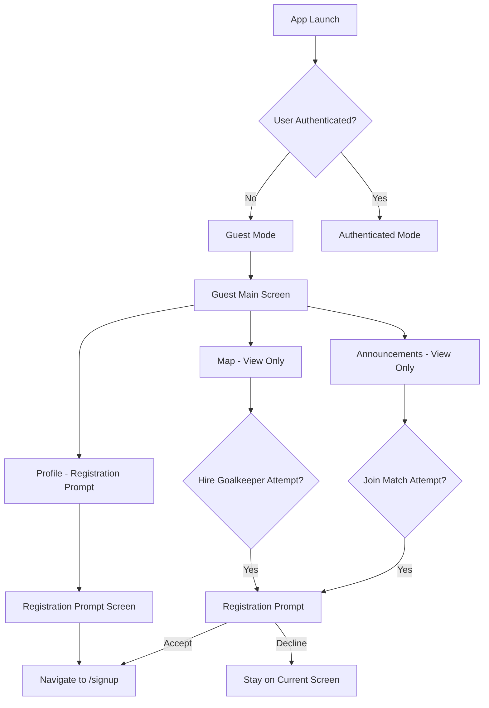

# Design Document

## Overview

The guest user experience feature will enable logged-out users to explore the goalkeeper app with limited functionality while maintaining the existing beautiful UI/UX design. The system will provide strategic prompts for account creation when users attempt restricted actions, creating a seamless path to registration without feeling pushy or restrictive.

## Architecture

### Authentication State Management

The current app uses Supabase authentication with a centralized auth state listener in `main.dart`. We'll extend this pattern to support guest users by:

1. **Guest Mode Detection**: Check `Supabase.instance.client.auth.currentSession == null` to determine guest status
2. **Route Protection**: Modify existing route guards to allow guest access to specific screens
3. **Action Interception**: Implement middleware to intercept restricted actions and show registration prompts

### Navigation Flow



## Components and Interfaces

### 1. Guest Mode Wrapper

**Purpose**: Wrap existing screens to provide guest-specific behavior

```dart
class GuestModeWrapper extends StatelessWidget {
  final Widget child;
  final bool requiresAuth;

  const GuestModeWrapper({
    required this.child,
    this.requiresAuth = false,
  });
}
```

### 2. Registration Prompt Dialog

**Purpose**: Consistent registration prompts across the app

```dart
class RegistrationPromptDialog extends StatelessWidget {
  final String title;
  final String message;
  final String actionContext; // "join match", "hire goalkeeper", etc.
}
```

### 3. Guest Profile Screen

**Purpose**: Replace profile screen content for logged-out users

```dart
class GuestProfileScreen extends StatelessWidget {
  // Shows registration prompt with beautiful design
}
```

### 4. Auth State Provider

**Purpose**: Extend existing auth patterns to support guest mode

```dart
class AuthStateProvider extends ChangeNotifier {
  bool get isGuest => Supabase.instance.client.auth.currentSession == null;

  Future<void> promptForRegistration(String context);
  void navigateToRegistration();
}
```

## Data Models

### Guest User Context

```dart
class GuestUserContext {
  final String sessionId; // Anonymous session tracking
  final DateTime sessionStart;
  final List<String> viewedContent; // Track engagement
  final int promptsShown; // Avoid over-prompting
}
```

### Registration Prompt Configuration

```dart
class RegistrationPromptConfig {
  final String title;
  final String message;
  final String primaryButtonText;
  final String secondaryButtonText;
  final String context; // For analytics
}
```

## Error Handling

### Guest Mode Errors

1. **Network Errors**: Show user-friendly messages without auth context
2. **Feature Restrictions**: Clear messaging about account benefits
3. **Navigation Errors**: Graceful fallbacks to guest-accessible screens

### Registration Flow Errors

1. **Registration Failures**: Handle gracefully and return to intended action
2. **Network Issues**: Offline-friendly messaging
3. **Validation Errors**: Clear field-specific feedback

## Testing Strategy

### Unit Tests

1. **Guest Mode Detection**: Test auth state evaluation
2. **Registration Prompts**: Test prompt logic and configuration
3. **Navigation Guards**: Test route protection logic
4. **Data Access**: Test guest-specific data filtering

### Integration Tests

1. **Guest User Flows**: Complete user journeys without authentication
2. **Registration Prompts**: End-to-end prompt and registration flow
3. **Screen Transitions**: Navigation between guest and auth screens
4. **Data Consistency**: Ensure guest users see appropriate content

### Widget Tests

1. **Guest Profile Screen**: UI rendering and interactions
2. **Registration Dialog**: Dialog behavior and styling
3. **Navigation Bar**: Guest-specific styling and behavior
4. **Content Screens**: Guest mode rendering of announcements and map

## Implementation Details

### Screen Modifications

#### MainScreen Updates

- Detect guest mode in `_MyAppState`
- Conditionally render guest-specific screens
- Maintain existing navigation structure

#### Announcements Screen

- Remove "Create Announcement" button for guests
- Add registration prompt to "Join Match" actions
- Maintain existing UI/UX for viewing posts

#### Map Screen

- Show all fields and goalkeeper locations
- Intercept "Hire Goalkeeper" actions
- Maintain existing map functionality and styling

#### Profile Screen

- Replace entire content for guests
- Beautiful registration prompt design
- Consistent with app's visual language

### Registration Prompt Strategy

#### Prompt Triggers

1. Join match attempt from announcements
2. Hire goalkeeper attempt from map
3. Profile screen access
4. Any other restricted action

#### Prompt Design

- Non-intrusive, friendly messaging
- Clear benefits of creating account
- Easy dismissal without guilt
- Consistent with app's design language

#### Prompt Frequency

- Track prompts shown per session
- Avoid over-prompting (max 3 per session)
- Smart timing based on user engagement

### Navigation Updates

#### Route Guards

```dart
bool _canAccessRoute(String route, bool isGuest) {
  final guestAllowedRoutes = [
    '/home', '/announcements', '/map', '/profile',
    '/signin', '/signup'
  ];

  if (isGuest) {
    return guestAllowedRoutes.contains(route);
  }

  return true; // Authenticated users can access all routes
}
```

#### Deep Link Handling

- Guest users accessing deep links get registration prompt
- After registration, redirect to intended destination
- Graceful fallback for invalid/restricted links

### UI/UX Considerations

#### Visual Consistency

- Maintain existing color scheme and typography
- Use same component library and styling
- Consistent animations and transitions

#### Guest Mode Indicators

- Subtle visual cues for guest status
- Clear but non-intrusive messaging
- Maintain app's premium feel

#### Registration Benefits

- Highlight exclusive features for registered users
- Show social proof and community aspects
- Emphasize value proposition without being pushy

## Security Considerations

### Data Access

- Ensure guests only access public data
- No sensitive user information exposure
- Proper data filtering at API level

### Session Management

- Anonymous session tracking for analytics
- No persistent storage of sensitive data
- Clear session boundaries

### Rate Limiting

- Prevent abuse of guest features
- Reasonable limits on content access
- Protection against scraping

## Performance Considerations

### Lazy Loading

- Load guest-specific components only when needed
- Minimize impact on authenticated user experience
- Efficient memory management

### Caching Strategy

- Cache public content for guest users
- Minimize API calls for repeated access
- Efficient data synchronization

### Bundle Size

- Minimize additional code for guest features
- Reuse existing components where possible
- Efficient asset loading
