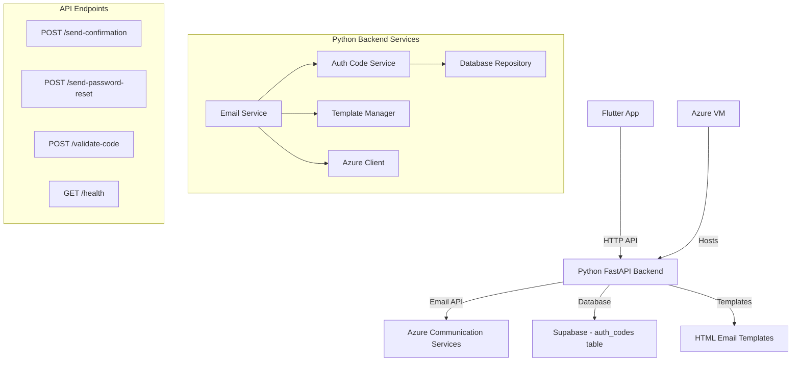

# Design Document

## Overview

This design implements a Python-based email backend service that replaces the existing Azure email functionality in the Flutter/Dart application. The service will be built using FastAPI for high-performance HTTP API handling and will run on an Azure Virtual Machine. The service will handle all Azure Communication Services interactions and authentication code management, providing a clean separation between the mobile application and email infrastructure.

The solution consists of a FastAPI application with endpoints for sending confirmation emails, password reset emails, and validating authentication codes. The service will use uv for modern Python package management and will connect to both Azure Communication Services for email delivery and Supabase for authentication code storage.

## Architecture

### High-Level Architecture



### Component Interaction Flow

1. **Email Request**: Flutter app sends HTTP request to Python backend
2. **Code Generation**: Backend generates secure authentication code
3. **Database Storage**: Code stored in Supabase auth_codes table
4. **Template Processing**: HTML template populated with code and URLs
5. **Email Sending**: Azure Communication Services sends email
6. **Response**: Backend returns success/error response to Flutter app
7. **Code Validation**: Separate endpoint validates codes when user clicks email links

## Components and Interfaces

### 1. FastAPI Application (`main.py`)

**Purpose**: Main application entry point and API route definitions

**Key Endpoints**:

- `POST /api/v1/send-confirmation`: Send email confirmation
- `POST /api/v1/send-password-reset`: Send password reset email
- `POST /api/v1/validate-code`: Validate authentication code
- `GET /health`: Health check endpoint
- `GET /`: Root endpoint with API information

**Dependencies**:

- FastAPI framework
- Pydantic for request/response models
- Environment configuration
- Service layer components

### 2. Email Service (`services/email_service.py`)

**Purpose**: Core service for orchestrating email operations

**Key Methods**:

- `send_confirmation_email(email: str, user_id: str) -> EmailResponse`: Sends signup confirmation
- `send_password_reset_email(email: str, user_id: str) -> EmailResponse`: Sends password reset
- `_compose_email(template_type: str, auth_code: str) -> str`: Composes email content
- `_send_via_azure(email_request: EmailRequest) -> bool`: Sends email via Azure

**Dependencies**:

- Azure Communication Services client
- Authentication code service
- Email template manager
- Configuration settings

### 3. Authentication Code Service (`services/auth_code_service.py`)

**Purpose**: Manages authentication code lifecycle and validation

**Key Methods**:

- `generate_code(user_id: str, code_type: AuthCodeType) -> str`: Generates secure code
- `validate_code(code: str, code_type: AuthCodeType) -> AuthCode | None`: Validates code
- `invalidate_code(code: str) -> bool`: Marks code as used
- `cleanup_expired_codes() -> int`: Removes expired codes

**Dependencies**:

- Database repository
- Secure code generator
- Logging service

### 4. Database Repository (`repositories/auth_code_repository.py`)

**Purpose**: Handles all database operations for authentication codes

**Key Methods**:

- `store_auth_code(auth_code: AuthCode) -> bool`: Stores code in database
- `get_auth_code_by_code(code: str) -> AuthCode | None`: Retrieves code by value
- `mark_code_as_used(code_id: str) -> bool`: Updates code status
- `delete_expired_codes() -> int`: Removes expired codes

**Dependencies**:

- Supabase client
- Data models
- Error handling

### 5. Azure Communication Client (`clients/azure_client.py`)

**Purpose**: Handles Azure Communication Services API interactions

**Key Methods**:

- `send_email(email_request: EmailRequest) -> AzureResponse`: Sends email via Azure
- `_build_azure_request(email_request: EmailRequest) -> dict`: Formats request
- `_handle_azure_response(response: httpx.Response) -> AzureResponse`: Processes response

**Dependencies**:

- httpx for HTTP client
- Azure configuration
- Retry logic and error handling

### 6. Template Manager (`services/template_manager.py`)

**Purpose**: Manages HTML email template processing

**Key Methods**:

- `load_template(template_name: str) -> str`: Loads HTML template
- `render_template(template: str, variables: dict) -> str`: Renders template with variables
- `generate_confirmation_url(auth_code: str) -> str`: Creates confirmation URLs
- `generate_reset_url(auth_code: str) -> str`: Creates reset URLs

**Dependencies**:

- Jinja2 for template rendering
- Configuration for URL generation

## Data Models

### Request/Response Models

```python
class EmailRequest(BaseModel):
    email: str = Field(..., description="Recipient email address")
    user_id: str = Field(..., description="User ID for the recipient")

class EmailResponse(BaseModel):
    success: bool = Field(..., description="Whether email was sent successfully")
    message: str = Field(..., description="Response message")
    message_id: str | None = Field(None, description="Azure message ID if successful")

class CodeValidationRequest(BaseModel):
    code: str = Field(..., description="Authentication code to validate")
    code_type: str = Field(..., description="Type of code (email_confirmation or password_reset)")

class CodeValidationResponse(BaseModel):
    valid: bool = Field(..., description="Whether code is valid")
    user_id: str | None = Field(None, description="User ID if code is valid")
    message: str = Field(..., description="Validation result message")

class HealthResponse(BaseModel):
    status: str = Field(..., description="Service health status")
    timestamp: datetime = Field(..., description="Health check timestamp")
    version: str = Field(..., description="Service version")
```

### Internal Data Models

```python
class AuthCode(BaseModel):
    id: str
    code: str  # Hashed version
    user_id: str
    type: AuthCodeType
    created_at: datetime
    expires_at: datetime
    is_used: bool
    used_at: datetime | None = None

class AuthCodeType(Enum):
    EMAIL_CONFIRMATION = "email_confirmation"
    PASSWORD_RESET = "password_reset"

class AzureEmailRequest(BaseModel):
    senderAddress: str
    recipients: dict
    content: dict
```

## Error Handling

### Error Categories

1. **Validation Errors**

   - Invalid email addresses
   - Missing required fields
   - Invalid request format

2. **Azure Communication Services Errors**

   - Network connectivity issues
   - Authentication failures
   - Rate limiting
   - Service unavailability

3. **Database Errors**

   - Connection failures
   - Query execution errors
   - Constraint violations

4. **Authentication Code Errors**
   - Expired codes
   - Invalid codes
   - Already used codes
   - Code generation failures

### Error Response Format

```python
class ErrorResponse(BaseModel):
    error: bool = True
    error_type: str = Field(..., description="Category of error")
    message: str = Field(..., description="Human-readable error message")
    details: dict | None = Field(None, description="Additional error details")
    timestamp: datetime = Field(default_factory=datetime.utcnow)
```

### HTTP Status Codes

- `200 OK`: Successful operations
- `400 Bad Request`: Invalid request data
- `401 Unauthorized`: Authentication failures
- `404 Not Found`: Resource not found
- `429 Too Many Requests`: Rate limiting
- `500 Internal Server Error`: Server errors
- `503 Service Unavailable`: External service failures

## Testing Strategy

### Unit Tests

1. **Service Layer Tests**

   - Mock external dependencies (Azure, Supabase)
   - Test business logic and error handling
   - Verify code generation and validation

2. **Repository Tests**

   - Mock database connections
   - Test CRUD operations
   - Verify query logic

3. **Client Tests**
   - Mock HTTP responses
   - Test request formatting
   - Verify error handling

### Integration Tests

1. **API Endpoint Tests**

   - Test complete request/response cycles
   - Verify error handling
   - Test authentication and validation

2. **Database Integration**
   - Test with real Supabase connection
   - Verify transaction handling
   - Test concurrent operations

### End-to-End Tests

1. **Email Flow Tests**

   - Test complete email sending process
   - Verify template rendering
   - Test code validation flow

2. **Error Scenario Tests**
   - Test Azure service failures
   - Test database connection issues
   - Test invalid input handling

## Security Considerations

### Authentication Code Security

- **Cryptographically Secure Generation**: Use Python's `secrets` module
- **Sufficient Entropy**: 32-character alphanumeric codes
- **Time-Limited Validity**: 5-minute expiration window
- **One-Time Use**: Codes invalidated after successful use
- **Secure Storage**: Codes hashed using bcrypt before database storage

### API Security

- **Input Validation**: Strict validation of all input parameters
- **Rate Limiting**: Implement rate limiting to prevent abuse
- **CORS Configuration**: Proper CORS settings for Flutter app access
- **Environment Variables**: Sensitive configuration stored in environment variables
- **HTTPS Only**: All communication over encrypted channels

### Azure Integration Security

- **Credential Management**: Azure keys stored as environment variables
- **Connection Security**: All Azure API calls over HTTPS
- **Error Information**: Avoid exposing sensitive information in error messages

## Configuration

### Environment Variables

```bash
# Server Configuration
HOST=0.0.0.0
PORT=8000
ENVIRONMENT=production

# Azure Communication Services
EMAIL_SERVICE=https://goalkeeper-comms.uk.communication.azure.com/
AZURE_KEY=your-azure-key
AZURE_CONNECTION_STRING=your-connection-string
EMAIL_FROM_ADDRESS=noreply@goalkeeper-finder.com
EMAIL_FROM_NAME=Goalkeeper-Finder

# Supabase Configuration
SUPABASE_URL=https://acnejemivawhcgsmsthb.supabase.co
SUPABASE_ANON_KEY=your-supabase-anon-key

# Application URLs
APP_BASE_URL=https://your-app-domain.com
CONFIRMATION_REDIRECT_PATH=/auth/confirm
RESET_REDIRECT_PATH=/auth/reset

# Logging
LOG_LEVEL=INFO
LOG_FORMAT=json
```

### Project Structure

```
email-service/
├── pyproject.toml
├── .env
├── .env.example
├── README.md
├── main.py
├── app/
│   ├── __init__.py
│   ├── config.py
│   ├── models/
│   │   ├── __init__.py
│   │   ├── requests.py
│   │   ├── responses.py
│   │   └── auth_code.py
│   ├── services/
│   │   ├── __init__.py
│   │   ├── email_service.py
│   │   ├── auth_code_service.py
│   │   └── template_manager.py
│   ├── repositories/
│   │   ├── __init__.py
│   │   └── auth_code_repository.py
│   ├── clients/
│   │   ├── __init__.py
│   │   └── azure_client.py
│   └── utils/
│       ├── __init__.py
│       ├── logging.py
│       └── security.py
├── templates/
│   ├── confirm_signup_template.html
│   └── reset_password_template.html
└── tests/
    ├── __init__.py
    ├── test_email_service.py
    ├── test_auth_code_service.py
    └── test_api_endpoints.py
```

## Integration Points

### Flutter App Integration

1. **HTTP Client Configuration**

   - Configure base URL for Python backend
   - Set appropriate timeouts and retry logic
   - Handle HTTP status codes and error responses

2. **Request/Response Handling**

   - Replace Azure-specific code with HTTP requests
   - Update error handling for HTTP responses
   - Maintain existing user experience

3. **Code Cleanup**
   - Remove Azure Communication Services dependencies
   - Remove authentication code generation logic
   - Remove template management code
   - Update service registration and dependency injection

### Azure VM Deployment

1. **VM Configuration**

   - Install Python 3.11+ and uv package manager
   - Configure firewall rules for HTTP/HTTPS access
   - Set up systemd service for automatic startup

2. **Application Deployment**

   - Clone repository and install dependencies with uv
   - Configure environment variables
   - Set up reverse proxy (nginx) for HTTPS termination
   - Configure logging and monitoring

3. **Monitoring and Maintenance**
   - Set up log rotation
   - Configure health check monitoring
   - Plan for updates and maintenance windows

## Performance Considerations

### Scalability

- **Async Operations**: Use FastAPI's async capabilities for I/O operations
- **Connection Pooling**: Implement connection pooling for database and HTTP clients
- **Caching**: Cache email templates and configuration
- **Rate Limiting**: Implement rate limiting to prevent abuse

### Monitoring

- **Health Checks**: Implement comprehensive health check endpoints
- **Metrics**: Track email send rates, error rates, and response times
- **Logging**: Structured logging for easy analysis and debugging
- **Alerting**: Set up alerts for service failures and high error rates
